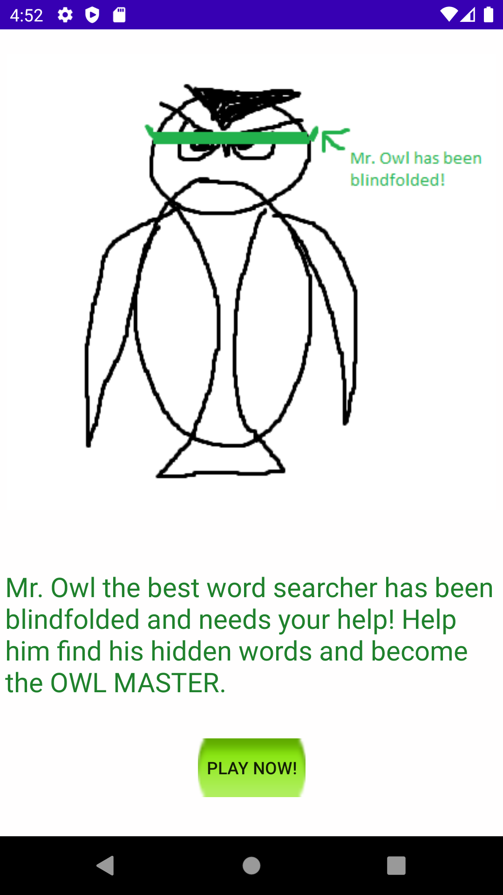
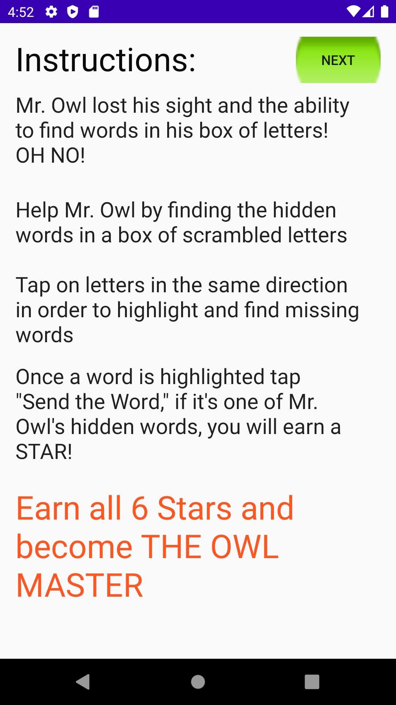
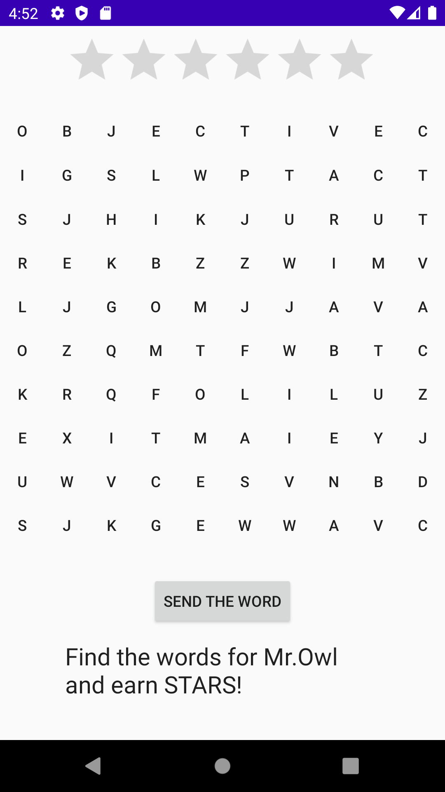
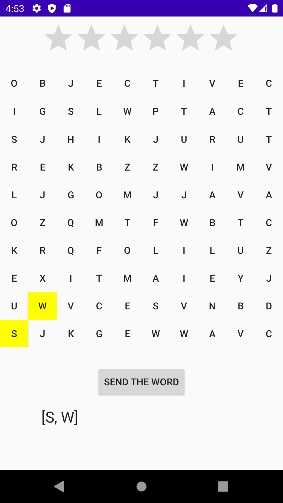
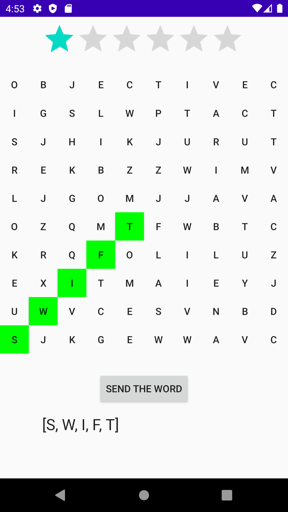
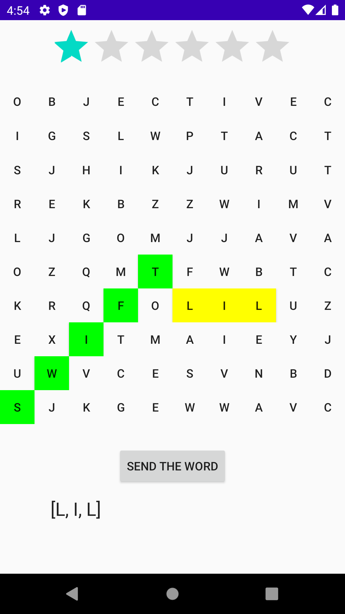
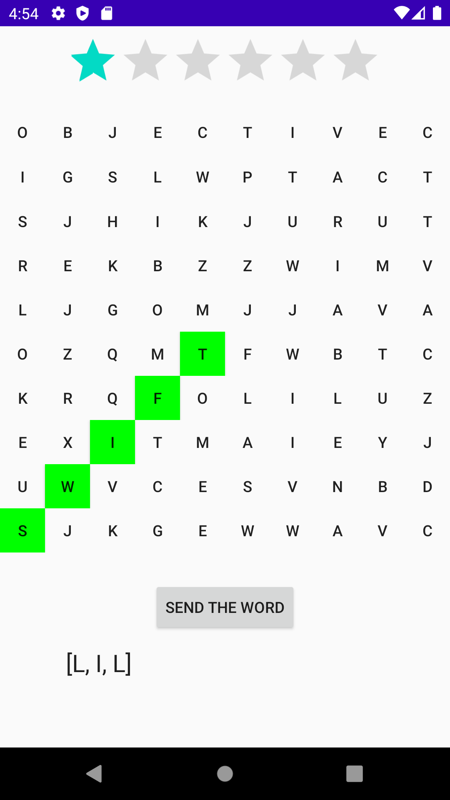
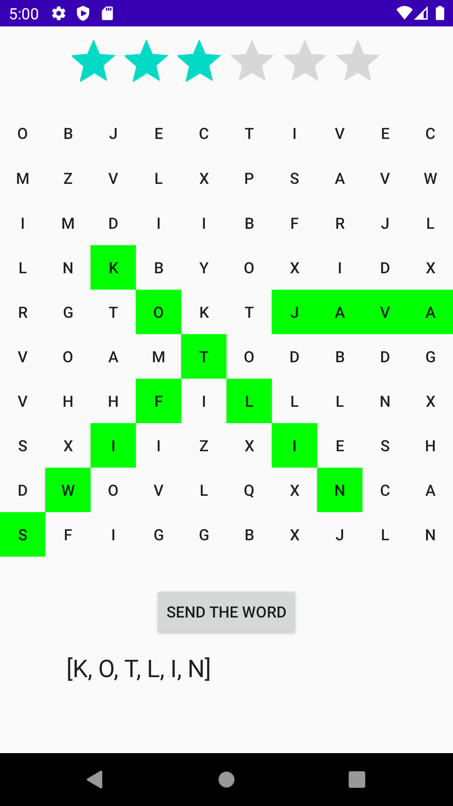
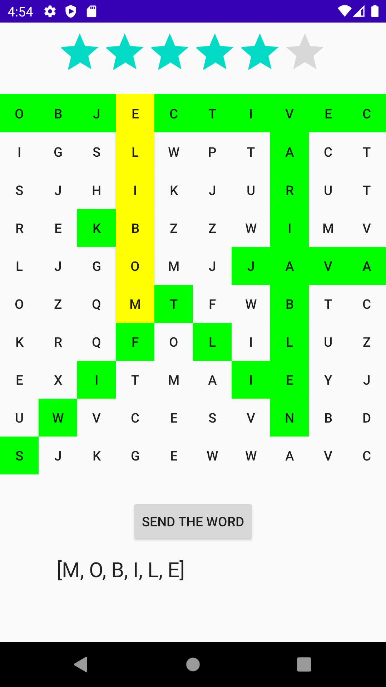
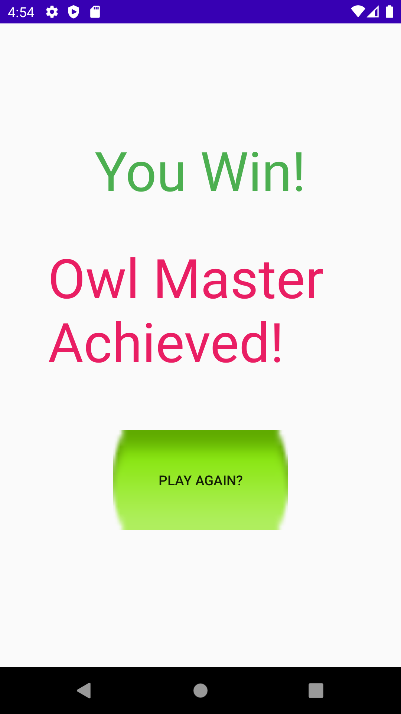

# Owl-Word-Search
A word search game created in Java using Android Studio. I created my own UI resources for fun and as a placeholder for the app.
(Accidentally added the repo to my school github and deleted it from there; however, still lists my personal school github account as a contributor)

# Intro
The game starts off by providing the user with a prompt, explaining the game's backstory of how Mr.Owl, a word search expert, has lost his sight by being blindfolded and needs the user's help in order to find the words needed. Doing so, allows the user to win the game and become The Owl Master.

# Instructions
Once the user taps on the "Play Now!" button on the previous screen they will be directed to the instructions page and is provided a series of instructions to help them understand and play the game.

# Words to Find
After the user is finished reading the instructions and taps on the "Next" button on the top right of the previous screen, they will be directed to the mission page where they are shown the six words the user needs to find in order to win the game. Once they're done reading, they can hit the "Begin" button on the bottom to proceed.

# Word Search Game

The following screenshot shows the word search game itself, in which the user has found no words reflected by the amount of stars (on the top) that the user has received. Here the user has just begun so they currently have 0 stars and none of the six words found.

Mechanics:
In this game the user has to tap on each letter separetly (highlighting the corresponding letter they tapped on yellow) in which once an entire word is highlighted yellow, the user must tap on the "Send the Word" button in order to submit the word to be checked to see if it was one of the six words the user was prompted to find. **The user only has the ability to tap on letters in the same linear fashion (ie: left, right, diagonally up right, etc. e.g: If they tap on a letter on the bottom corner of the screen and attempt to tap another letter anywhere else such as the top right of the screen they will not have the ability to and the letter will not be highlighted nor will their input be taken into account)** If the word was correct, the entirety of the word will now be highlighted in green. And a corresponding star will be added to their score. If the word was not correct, the letters will no longer be highlighted, thus clearing their input. At the moment this is also the only way to clear mistaken input. 

(Note: The letters on the board are generated randomly, except for the letters that belong to the six words we need to find. The incorrect word "LIL" would most likely not show up on any other generations of the word grid. The six words are also always positioned in the same spots.)

Tapping on letters-> 

Finding a correct word-> 

Finding a wrong word-> 

Sending wrong word->

The next screenshot shows a situation where the user has found some words and received the correlating amount of stars as their score. Here the user has found the words Java, Kotlin, and Swift. The user has now received 3 out of 6 stars.

(Retook this screenshot, taken on a new run, "LIL" changed to "LLL")

The next image shows that now the user has found 5 out of 6 words. The user has the last word they need selected and all they need to do is tap on "Send the Word" in order to win and proceed.

# Winner!

Once they've sent the word and have earned all six stars. The user will now be sent to the winning page telling the user that they have achieved becomming an owl master. The user will also be prompted with a button asking them if they want to play again, thus restarting the whole process starting from the intro screen.

